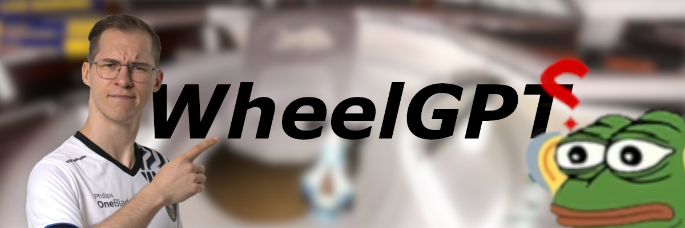
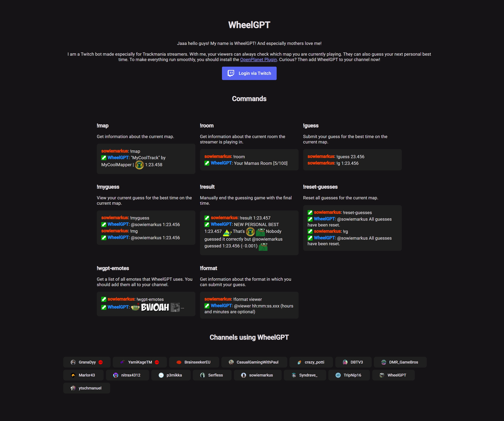
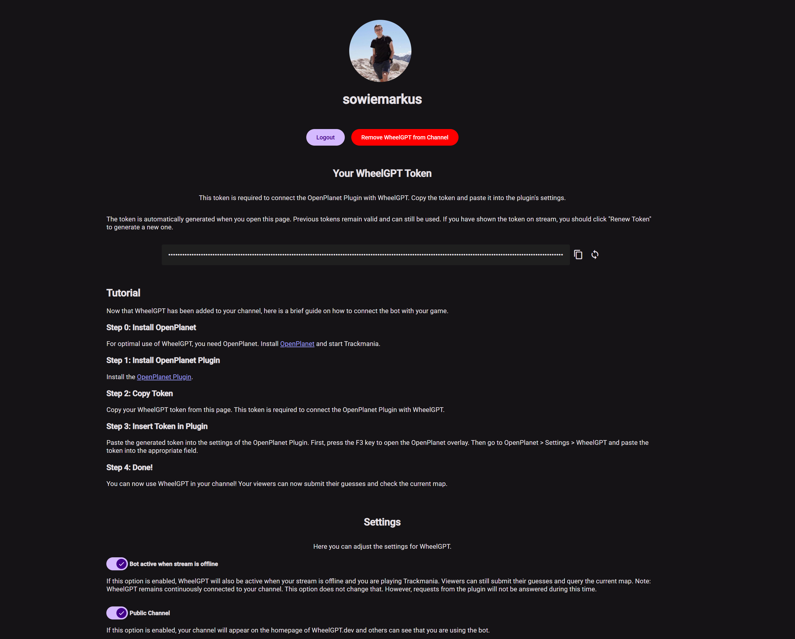
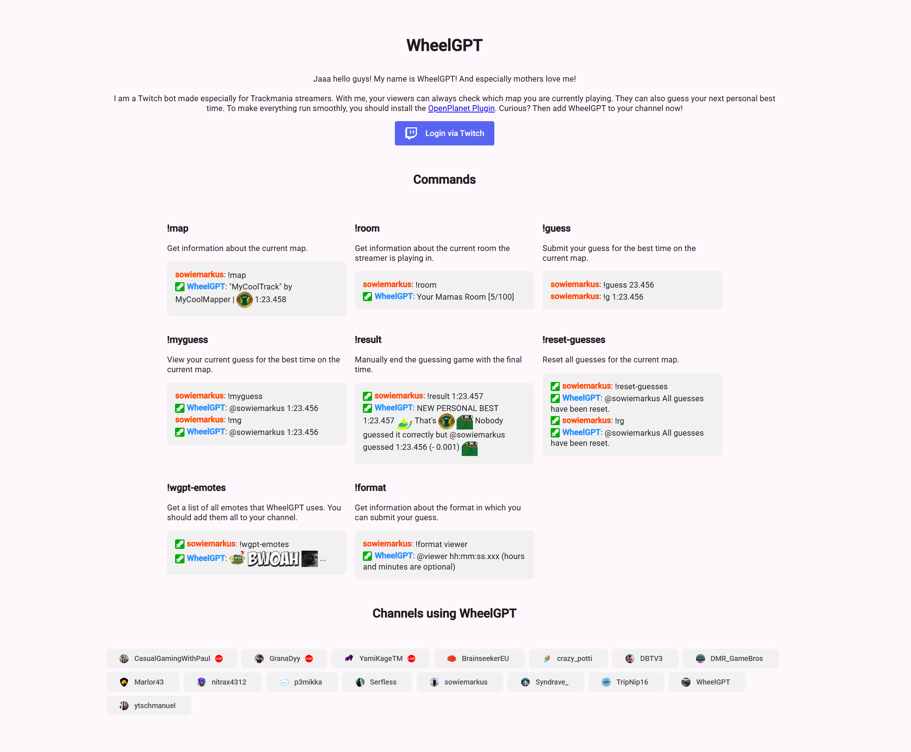
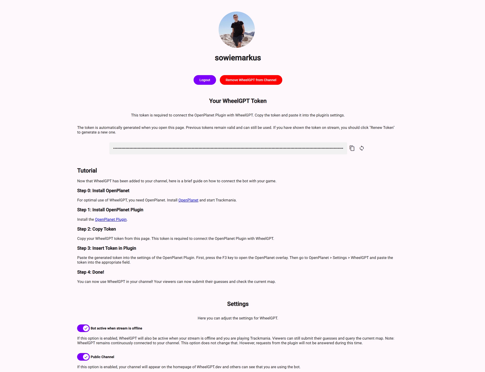

[](https://github.com/apps/in-solidarity)

More information on [wheelgpt.dev](https://wheelgpt.dev). Get the [OpenPlanet Plugin](https://openplanet.dev/plugin/wheelgpt-plugin).

WheelGPT is a [Trackmania](https://www.trackmania.com/) Twitch bot that lets viewers interact with the stream in real time. Viewers can use chat commands to check the current map, guess the streamer’s next personal best time, and get information about the current Trackmania room the streamer is playing in. All in-game data is collected and sent to the server by a dedicated Openplanet plugin, ensuring the bot always provides up-to-date information. Originally developed for GranaDyy – the wheel guy – WheelGPT now brings interactive Trackmania experiences to any Twitch channel.

The frontend application, built with Angular and available at [wheelgpt.dev](https://wheelgpt.dev), provides an intuitive interface to configure the bot and connect it to your Twitch channel. The web application features support for both light and dark themes, and offers multilingual support for German, French, and English.

See the [Screenshots](#screenshots) section below for visual examples of the interface.

## Any Questions? Feedback?

For more detailed information, check out the [documentation](./docs/).
If you have any questions regarding the plugin or the Twitch Bot, feel free to contact me:

- Discord: sowiemarkus
- [markus.u.wieland@gmail.com](mailto:markus.u.wieland@gmail.com)

## Features

### Token

To use this plugin, you need a token. For that you need to register on [wheelgpt.dev](https://wheelgpt.dev). The token assigned to you is sent with every request to our server and identifies your Twitch channel. So don't share this token with anyone. Otherwise, others can use the plugin under your name and, for example, send best times to your Twitch channel that you have never driven.

The token assigned to you must be entered in the `Settings` -> `WheelGPT-Plugin` -> `Info/Token`.

### Personal Best

With the Twitch Bot, your viewers can guess what your next best time will be with `!guess <time>`. The format of the time is `hours:minutes:seconds.milliseconds`. `Hours` and `minutes` are optional. Example: `!guess 12.345` or `!guess 01:23.456`.

If the plugin is activated, whenever you set a new best time on a map, this time will be sent to our server. Afterwards all received guesses of your users will be checked and in the bot will announce in the chat which viewer was closest with the guess.

If you want to deactivate that your best times are sent to our server, you can deactivate this under `Settings` -> `WheelGPT-Plugin` -> ` Send PBs to Server`.

### Map

With the Twitch bot, viewers can use the command `!map` to find out which map you are currently playing.
If the plugin is activated, whenever you enter a new map, this map is sent to our server. If you use the `Champion Medals` plugin, the Champion Medal time will also be sent to the server.

If you want to disable this feature, you can deactivate this under `Settings`->`WheelGPT-Plugin`->` Send Maps to Server`.

### Room

With the Twitch bot, viewers can use the command `!room` to get information about the current Trackmania room the streamer is playing in.  
If the plugin is activated, whenever you join a room, the room information (such as name, host, and player count) is sent to our server. This allows viewers to always see up-to-date room details via the bot.

If you want to disable this feature, you can deactivate it under `Settings` -> `WheelGPT-Plugin` -> `Send Rooms to Server`.

## Getting Started

1. Create a `.env` file based on the provided example.
2. Build the Docker image:

   ```sh
   docker build -t wheelgpt-app .
   ```

3. Run the Docker container:

   ```sh
   docker run -p 3000:<port_from_env> wheelgpt-app
   ```

   This will start the backend server on port 3000.  
   You can adjust the port mapping as needed.

## Development

1. Run `npm run setup`
2. Run `npm run dev:all`

## Screenshots





